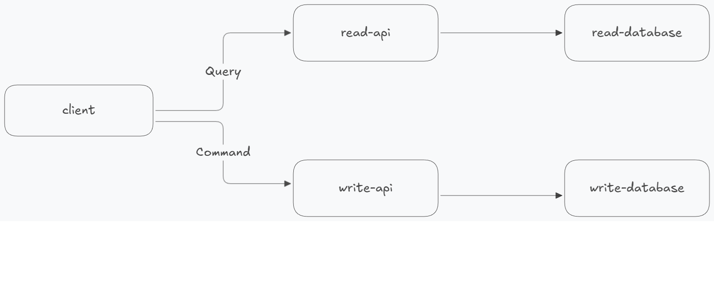
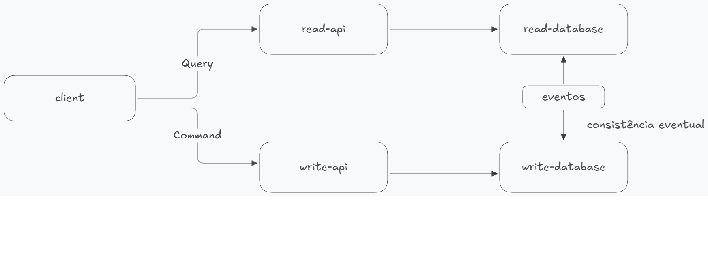

# Aprendendo CQRS (Command Query Responsability Segregation)

CQRS é um padrão arquitetural, criado em 2010 derivado de outro padrão chamado CQS (Command Query Separation). O objetivo é separar operações de leitura e escrita em estruturas
_físicas_ apartadas, ou seja, armazenamentos e aplicações diferentes.
i
Quanto as operações, entende-se que _Command_ são operações que vão mutar o estado de uma entidade, em termos simples, são operações de inserção e atualização e _Query_ são reservadas para consultas
sobre o estado de uma determinada entidade.

A nível de arquitetura numa primeira instância, é bem simples a ideia é reservar um banco de dados para escrita e outro para leitura e ter aplicações para cada tipo de operação. A brincadeira começa a esquentar quando olhamos para como sincronizar as entidades que estão persistidadas primeiramente no banco de escrita para o banco de leitura.

## Antes de tudo, o que eu ganho utilizando CQRS?

Lembrando é apenas uma opinião minha no que vou escrever aqui, mas eu acredito que grande vantagem de utilizar CQRS é ganhar processamento para operações escritas que são pesadas e otimizar consultas complexas que dependem de um número considerável de entidades.

Com isso, eu consigo ver algumas coisas interessantes surgindo por exemplo:

- Ter um banco relacional para escrita e não relacional para leitura.
- Persistir a consulta previamente "pronta", por exemplo se usado um banco não relacional é possível já persistir a consulta que unifica informações de diferentes entidades,
  não é mais preciso fazer vários `JOINS`.
- Direcionar mais recurso para quem precisa, se operações de escrita são mais pesadas invista nelas ou o contrário.
- Brincar com eventos, supondo que após persistir uma entidade a API de escrite emita um evento em uma fila com metadados relacionados, aplicações que consomem essa fila pode criar conforme seu domínio consultas diferentes.

Na litetura com certeza os conceitos estão bem detalhados e aprofundados, vou deixar no final alguns artigos e referências sobre o tema.

## Quando as coisas começam a esquentar 🔥

CQRS pode acabar gerando algumas complexidades dependendo do contexto em que for aplicado, que estão atreladas na maneira que será sincronizado o banco de escrita e o de leitura.

Geralmente, essa replicação de dados pode ser feita via eventos, ou seja, a aplicação de escrita disponibiliza em algum canal um evento com informações sobre a entidade persistida ou alterada e aplicação de escrita consome esse evento e replica os dados na sua base.

Nesse ponto, não precisa necessariamente ser uma cópia exata de informações. Ao invés disso, já armazenar o resultado da consulta em si ou documentos. Quando olhado para essa leitura, a integridade dos dados não é prioridade.

Imaginando um fluxo de trabalho para resumir:

1. A aplicação de escrita recebe uma nova requisição para inserir ou atualizar um objeto.
2. Realiza operação no banco de dados.
3. Emite esse evento ou mensagem com as informações atualizadas.
4. A aplicação de leitura ou de sincronização, recebe o evento e replica os dados para o banco de leitura.

## Pontos de atenção

A definição de uso do CQRS é bem simples até, mas existe algumas questões que devem ser postas a mesa.

E se o evento for emitido, mas a transação no banco de dados de escrita der errado?

Ou o contrário, a transação é realizada corretamente mas a postagem do evento não ocorre?

Tem alguns patterns para trabalhar como resiliência nesses casos, como _Dual Write_ e _Outbox_ que podem ser boas soluções para esses cenários, mas não vou me aprofundar neles, fica para uma próxima.

## Algumas reflexões finais 💭

CQRS traz essa ideia de divisão das aplicações entre escrita e leitura, mas em um projeto de contexto menor e que o uso é controlado e que tem consultas um pouco mais estruturadas. Até faz sentido, usar _Views_.

A realidade nem sempre é como a teoria, se no contexto o que cabe é criar views materializadas, que seja. Estude a viabilidade do uso e verifique se o ganho vale a pena, já que pode custar processamento para a aplicação e banco de dados.

## Case prático

Para ver o CQRS em ação, desenhei um case bem simples.

Optei por utilizar algumas tecnologias distintas para demonstrar a versatilidade do CQRS. Para a aplicação de escrita/command foi utilizado Go para criar uma REST API que realiza a persistência em um banco de dados relacional PostgreSQL, além de publicar um evento no Redis, que será utilizado como Pub/Sub.

Para leitura, existe uma aplicação intermediária para sincronizar os eventos e persistir os dados já 'pré-processados' para leitura em um banco não-relacional MongoDB. No final, operações de leituras/query são realizadas por uma REST API construída em Node.
